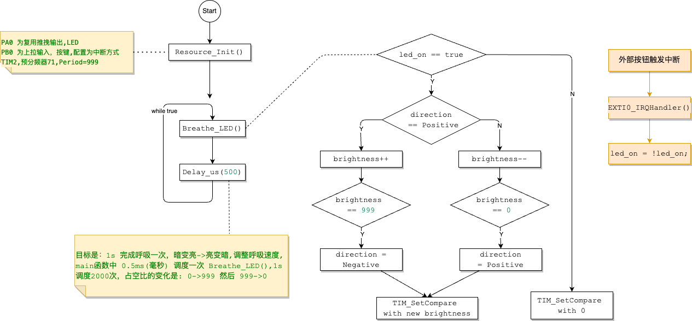

# 制作⼀个呼吸灯

• ⽬标：制作⼀个 LED 呼吸灯，并使⽤ 按键1 控制 LED 开关  
• 提⽰：利⽤ TIM 的 PWM 输出实现  

• 问题：  
    ◦ 配置 TIM 的⼤致流程是怎样的？  
    ◦ 此时控制 LED 的 GPIO 需要配置为什么模式？为什么？  
    ◦ 简要介绍 PWM 的输出构成以及如何计算相应参数  


---

## 1. **硬件连接**
   - **2个LED**：分别连接到 `PA0` 和 `PA1` 引脚。正极(长脚)接GPIO口，负极接GND，这样是高电平点亮，方便编写代码，这里跟板载LED的方式就不一样了。
   - **按键1**：连接到 `PB0` 引脚，用作控制 LED 呼吸灯的开关。
   - **呼吸灯效果**：利用定时器的 PWM 输出，控制 LED 的亮度从 0% 到 100% 再到 0%，形成渐亮渐暗的呼吸灯效果。

## 2. **总体思路**
   - 利用定时器的 PWM 功能控制 LED 亮度，通过调整 PWM 占空比来实现呼吸灯效果。
   - 通过外部中断检测按键的按下，实现呼吸灯的开关切换。
   - 系统上电时，两个 LED 默认进入呼吸模式，按下按键后关闭呼吸灯，再按一次按键恢复呼吸灯效果。

## 3. **步骤解析**

### 3.1 **GPIO 配置**
   - **PA0 和 PA1**：配置为定时器的 PWM 输出引脚，使用推挽复用输出模式（`GPIO_Mode_AF_PP`）。
   - **PB0**：配置为上拉输入模式（`GPIO_Mode_IPU`），并关联到 EXTI 外部中断线路，检测按键按下。

### 3.2 **定时器 (TIM) 配置**
   - 使用 **TIM2**（或其他定时器）来生成 PWM 信号。
   - TIM2 有多个输出通道，分别对应到 `PA0` 和 `PA1`。
   - **PWM 频率**：通常设置为 1kHz，以避免 LED 闪烁。
   - **PWM 周期**：通过改变 PWM 占空比（0% 到 100% 再到 0%），控制 LED 的亮度变化，形成呼吸灯效果。
     - 可以在定时器中通过调整 `TIM_SetCompare()` 函数来实时更新 PWM 占空比，实现 LED 的渐亮渐暗效果。
   - 使用两个独立的通道来分别控制 `PA0` 和 `PA1` 上的 LED。

### 3.3 **呼吸灯效果**
   - 通过一个定时循环函数，逐步增加和减少 PWM 占空比，从而实现 LED 的呼吸效果：
     - **增加占空比**：LED 逐渐变亮。
     - **减少占空比**：LED 逐渐变暗。
   - 每次更新占空比时，使用 `TIM_SetCompareX()` 来调整相应通道的 PWM 占空比。

### 3.4 **按键检测**
   - 使用 **EXTI（外部中断）** 来检测按键 `PB0` 的按下：
     - **下降沿触发中断**：按键按下时产生中断。
     - 在中断处理函数中，切换一个标志变量（`led_on`），用于控制 LED 呼吸灯的开关状态。
     - 按下按键时，如果呼吸灯正在运行，则关闭呼吸灯；如果呼吸灯已关闭，则重新启动呼吸灯。

### 3.5 **状态管理**
   - 通过全局变量 `led_on` 来记录当前 LED 的状态：
     - 初始状态：`led_on = 1`，表示 LED 呼吸灯开启。
     - 当检测到按键按下后，切换 `led_on` 的状态：
       - 如果 `led_on == 1`，则关闭 LED 呼吸效果（将 PWM 占空比设置为 0）。
       - 如果 `led_on == 0`，则重新启动呼吸灯效果。

### 3.6 **中断处理逻辑**
   - 在外部中断处理函数中，执行以下操作：
     1. 检查中断是否由 `PB0` 按键触发。
     2. 切换 LED 状态：
        - 如果当前 LED 处于呼吸模式，则停止呼吸灯效果。
        - 如果当前 LED 关闭，则重新启动呼吸灯效果。
     3. 清除中断标志位，准备下一次中断检测。

## 4. **延时与占空比调整**
   - 为了控制呼吸灯的速度，可以使用定时器或简单的延时循环控制呼吸周期。比如通过调整 `PWM` 的更新频率，使 LED 每秒完成一次完整的呼吸循环。

## 5. **主要模块总结**
   - **GPIO 配置**：PA0 和 PA1 作为 PWM 输出引脚，PB0 作为按键输入。
   - **TIM 定时器**：设置 PWM 频率为 1kHz，通过占空比调节 LED 亮度。
   - **EXTI 外部中断**：用于检测按键按下，切换 LED 呼吸灯的开关。
   - **PWM 占空比调整**：动态调节占空比以实现呼吸灯效果。
   - **按键状态切换**：每按一次按键，切换 LED 呼吸灯的开关状态。


## 代码

**参见工程2-breathing-light**

## 流程图


<BR><BR><BR>
---
# Q1:配置 TIM 的⼤致流程是怎样的?
在 STM32 中配置定时器（TIM）的基本流程一般分为以下几个步骤，下面以基本的定时器和 PWM 输出的配置为例：

### 1. **使能定时器时钟**
   在配置定时器之前，首先要使能与定时器相关的时钟。STM32 有多个定时器（TIM1、TIM2、TIM3 等），它们的时钟是独立的，需要通过 RCC 外设来使能。
   ```c
   RCC_APB1PeriphClockCmd(RCC_APB1Periph_TIM2, ENABLE);  // 启动 TIM2 的时钟
   ```

### 2. **配置定时器基础参数**
   定时器的基础参数包括自动重装载值（`Period`）、预分频器（`Prescaler`）、计数模式等。通过这些参数，你可以设置定时器的工作频率和计数模式。
   - **Period**：决定定时器的周期，当计数器到达该值时，定时器计数器会重置。
   - **Prescaler**：用于对输入时钟进行分频，从而调整定时器的计数频率。
   - **计数模式**：可以设置为向上、向下或中心对齐模式。

   代码示例：
   ```c
   TIM_TimeBaseInitTypeDef TIM_TimeBaseStructure;
   TIM_TimeBaseStructure.TIM_Period = 999;  // 设置自动重装载值，控制周期
   TIM_TimeBaseStructure.TIM_Prescaler = 71;  // 设置预分频器，控制计数器时钟频率
   TIM_TimeBaseStructure.TIM_ClockDivision = TIM_CKD_DIV1;  // 时钟分频
   TIM_TimeBaseStructure.TIM_CounterMode = TIM_CounterMode_Up;  // 向上计数模式
   TIM_TimeBaseInit(TIM2, &TIM_TimeBaseStructure);
   ```

### 3. **配置定时器的输出比较功能（PWM 或其他）**
   如果你使用定时器的 PWM 功能，接下来需要配置定时器的输出比较通道。输出比较通道决定了定时器的比较行为和占空比输出。

   - **OCMode**：设置 PWM 模式，比如 `TIM_OCMode_PWM1`。
   - **Pulse**：设置 PWM 的占空比，决定输出信号的高电平持续时间。
   - **OutputState**：启用或禁用输出。
   - **OCPolarity**：设置输出极性，决定是高电平有效还是低电平有效。

   代码示例：
   ```c
   TIM_OCInitTypeDef TIM_OCInitStructure;
   TIM_OCInitStructure.TIM_OCMode = TIM_OCMode_PWM1;  // PWM 模式 1
   TIM_OCInitStructure.TIM_OutputState = TIM_OutputState_Enable;  // 启用输出
   TIM_OCInitStructure.TIM_Pulse = 500;  // 设置占空比
   TIM_OCInitStructure.TIM_OCPolarity = TIM_OCPolarity_High;  // 高电平有效
   TIM_OC1Init(TIM2, &TIM_OCInitStructure);  // 初始化 TIM2 的通道 1
   ```

### 4. **启动定时器**
   在配置完定时器之后，需要启动定时器，让其开始计数或产生 PWM 信号。

   代码示例：
   ```c
   TIM_Cmd(TIM2, ENABLE);  // 启动定时器
   ```


### 总结：
配置 STM32 定时器的大致流程为：
1. 启用定时器时钟。
2. 配置定时器的基础参数（周期、预分频器、计数模式等）。
3. 配置输出比较功能（如 PWM 模式）。
4. 启动定时器。


根据不同的应用场景（如 PWM 输出、输入捕获、定时功能），定时器的配置可能有所不同。

# Q2: 控制 LED 的 GPIO 需要配置为什么模式？为什么？
`GPIO_Mode_AF_PP` 是 STM32 标准外设库中的一个常量，用于配置 GPIO 引脚的模式。它表示**复用推挽输出模式**（Alternate Function Push-Pull）。

### 详细解释：
1. **AF（Alternate Function）**：代表**复用功能**。STM32 的 GPIO 引脚可以复用为不同的外设功能。例如一个引脚既可以作为普通的 GPIO，也可以用来作为定时器输出、UART 通信等。当你将引脚配置为 `AF` 模式时，它将不再是普通的 GPIO 输入/输出，而是复用为与外设相关的功能。

2. **PP（Push-Pull）**：代表**推挽输出**。在推挽模式下，GPIO 引脚可以输出高电平（连接到 VDD）或低电平（连接到 GND），这是常用的输出模式，可以驱动负载（如 LED、外设等）。

### 应用场景：
- 当 GPIO 引脚被配置为用于 **PWM 输出** 时（例如控制 LED 亮度），需要设置为 `GPIO_Mode_AF_PP`，使其复用为定时器通道的输出引脚。


# Q3:PWM 的输出构成
### PWM 的输出构成

**PWM（脉宽调制）**的输出由两个关键部分构成：**频率**和**占空比**。

1. **频率**：PWM 信号的频率定义了一个完整的 PWM 周期持续多长时间。频率越高，周期越短。
2. **占空比**：占空比是高电平时间相对于整个周期的比例。它决定了在一个周期内高电平维持的时间长度，进而影响输出的平均功率。

### 关键参数及其计算

1. **周期（T）**：周期是信号从开始到结束、然后重复的时间长度。它是频率的倒数：
   ```
   T = 1 / 频率
   ```
   例如，频率为 1 kHz 时，周期为 1 毫秒（ms）。

2. **占空比**：占空比是高电平持续时间（高电平时间）相对于整个周期的百分比：
   ```
   占空比 = （高电平时间 / 周期） * 100%
   ```
   例如，如果周期为 1 毫秒，且高电平时间为 0.5 毫秒，则占空比为 50%。

3. **频率的计算**：PWM 频率是由定时器时钟频率、预分频器和自动重装载值共同决定的。假设定时器时钟频率为 `f_clk`，预分频器为 `Prescaler`，周期计数器（即自动重装载值）为 `ARR`，则频率计算公式为：
   ```
   频率 = f_clk / ((Prescaler + 1) * (ARR + 1))
   ```
   例如，如果时钟频率为 72 MHz，预分频器设置为 71，自动重装载值为 999，则 PWM 频率为：
   ```
   频率 = 72,000,000 / ((71 + 1) * (999 + 1)) = 1 kHz
   ```

4. **占空比的计算**：占空比由定时器的输出比较寄存器值（`CCR`）决定。`CCR` 表示高电平持续的计数值，而 `ARR` 是整个周期的计数值：
   ```
   占空比 = (CCR / ARR) * 100%
   ```
   例如，若 `ARR` 为 999，`CCR` 为 500，则占空比为：
   ```
   占空比 = (500 / 999) * 100% ≈ 50%
   ```

### 总结
- **频率**决定了 PWM 信号的周期长短，**占空比**则决定了在一个周期内高电平维持的时间。
- 可以通过调节定时器的 `Prescaler`、`ARR` 和 `CCR` 来灵活控制 PWM 的频率和占空比，从而实现对输出功率、亮度或速度的精确控制。

---

# 核心代码
```c
#include "stm32f10x.h"  // Device header
#include "stm32_util.h" // My Utility

static uint8_t Positive = 0; // LED变亮的方向
static uint8_t Negative = 1; // LED变暗的方向

static uint8_t led_on = 1; // LED 开关状态
static uint16_t brightness = 0;
static uint8_t breathing_direction = 0;

void Resource_Init(void)
{
    /*GPIO 配置 START----------------------------------------------------------------------------------------*/
    RCC_APB2PeriphClockCmd(RCC_APB2Periph_GPIOA | RCC_APB2Periph_GPIOB, ENABLE);

    UTIL_GPIO_CFG(GPIOA, GPIO_Pin_0, GPIO_Speed_50MHz, GPIO_Mode_AF_PP); /*PA0 为复用推挽输出，用于 PWM 输出,LED*/
    UTIL_GPIO_CFG(GPIOA, GPIO_Pin_1, GPIO_Speed_50MHz, GPIO_Mode_AF_PP); /*PA1 为复用推挽输出，用于 PWM 输出,LED*/
    UTIL_GPIO_CFG(GPIOB, GPIO_Pin_0, GPIO_Speed_50MHz, GPIO_Mode_IPU);   /*PB0 为上拉输入，用于按键输入,BUTTON*/
    /*GPIO 配置 END------------------------------------------------------------------------------------------*/

    /*TIM 配置 START------------------------------------------------------------------------------------------*/
    /*TIM2 属于低速定时器，时钟源来自于 APB1 总线，通过 APB1 外设时钟使能*/
    RCC_APB1PeriphClockCmd(RCC_APB1Periph_TIM2, ENABLE);
    /*
     * 配置定时器基本参数,目标是 TIM2
     * STM32 的时钟频率为72 MHz，预分频器通常设为 71
     * Period=999 自动重装载值,选择 1kHz的PWM频率，这样在1s内可以有1000个调节点
     * Prescaler=71
     * TIM_CKD_DIV1 设置定时器不进行任何时钟分频，使其直接使用原始时钟频率。对于精确的时间计数或者快速响应的应用场景.
     * TIM_CounterMode_Up :设置定时器的计数模式为向上计数模式
     */
    UTIL_TIM_BASE_CFG(TIM2,
                      /* TIM_TimeBaseStructure */ 999, 71, TIM_CKD_DIV1, TIM_CounterMode_Up);

    /*
     * 配置 PWM 模式;目标是 TIM2_CH1/2 设置为TIM_OCMode_PWM1模式，OCMode(Output Compare Mode)
     *
     * Channel 和 GPIO 的对应关系如下：
     * TIM2_CH1 => PA0;TIM2_CH2 => PA1;TIM2_CH3 => PA2;TIM2_CH4 => PA3
     *
     * TIM_OCMode       = TIM_OCMode_PWM1;在 PWM模式1下，输出比较寄存器(CCR)的值决定了信号的占空比
     * State=TIM_OutputState_Enable;TIM_Pulse=0;OCPolarity=TIM_OCPolarity_High
     */
    UTIL_TIM_PWM_CFG(TIM2, 1, /*PA0*/
                     /* TIM_OCInitStructure */ TIM_OCMode_PWM1, TIM_OutputState_Enable, 0, TIM_OCPolarity_High);

    UTIL_TIM_PWM_CFG(TIM2, 2, /*PA1*/
                     /* TIM_OCInitStructure */ TIM_OCMode_PWM1, TIM_OutputState_Enable, 0, TIM_OCPolarity_High);

    TIM_Cmd(TIM2, ENABLE); /* 启动 TIM2*/
    /*TIM 配置 END----------------------------------------------------------------------------------------------*/

    /*中断配置 START---------------------------------------------------------------------------------------------*/
    RCC_APB2PeriphClockCmd(RCC_APB2Periph_AFIO, ENABLE);        /*使能 AFIO 时钟*/
    GPIO_EXTILineConfig(GPIO_PortSourceGPIOB, GPIO_PinSource0); /*选择 PB0 作为中断源*/

    /*Line=EXTI_Line0; Mode=Interrupt; Trigger=Falling下降沿触发; Cmd=ENABLE*/
    UTIL_EXTI_CFG(EXTI_Line0, /*EXTI_Line0 与 GPIO 的第 0 号引脚（PA0、PB0 等）相互对应*/
                  /* EXTI_InitTypeDef */ EXTI_Mode_Interrupt, EXTI_Trigger_Falling, ENABLE);

    UTIL_NVIC_CFG(EXTI0_IRQn,    /*配置中断优先级, 处理来自 GPIO 引脚 0（如 PA0、PB0）的中断事件*/
                  0, 0, ENABLE); /*PreemptionPriority=0; SubPriority=0*/
    /*中断配置 END-----------------------------------------------------------------------------------------------*/
}

void EXTI0_IRQHandler(void)
{
    if (EXTI_GetITStatus(EXTI_Line0) != RESET)
    {
        led_on = !led_on;                   // 切换 LED 开关状态
        EXTI_ClearITPendingBit(EXTI_Line0); // 清除中断标志
    }
}

void Breathe_LED(void)
{
    if (led_on)
    {
        if (breathing_direction == Positive)
        {
            brightness++;
            if (brightness >= 999)
                breathing_direction = Negative;
        }
        else
        {
            brightness--;
            if (brightness == 0)
                breathing_direction = Positive;
        }

        TIM_SetCompare1(TIM2, brightness); // 调整 TIM2 通道 1 的比较值，改变占空比
        TIM_SetCompare2(TIM2, brightness); // 调整 TIM2 通道 2 的比较值，改变占空比
    }
    else
    {
        // 如果 LED 关闭，停止 PWM 输出
        TIM_SetCompare1(TIM2, 0);
        TIM_SetCompare2(TIM2, 0);
    }
}

int main(void)
{
    Resource_Init();

    while (1)
    {
        Breathe_LED(); // 控制 LED 呼吸灯

        Delay_us(500); /**
                        *
                        * 目标是：1s 完成呼吸一次，暗变亮->亮变暗,
                        * 调整呼吸速度, main函数中 0.5ms(毫秒) 调度一次 Breathe_LED()
                        * 1s 调度2000次，占空比的变化是: 0->999 然后 999->0
                        *
                        */
    }
}
```