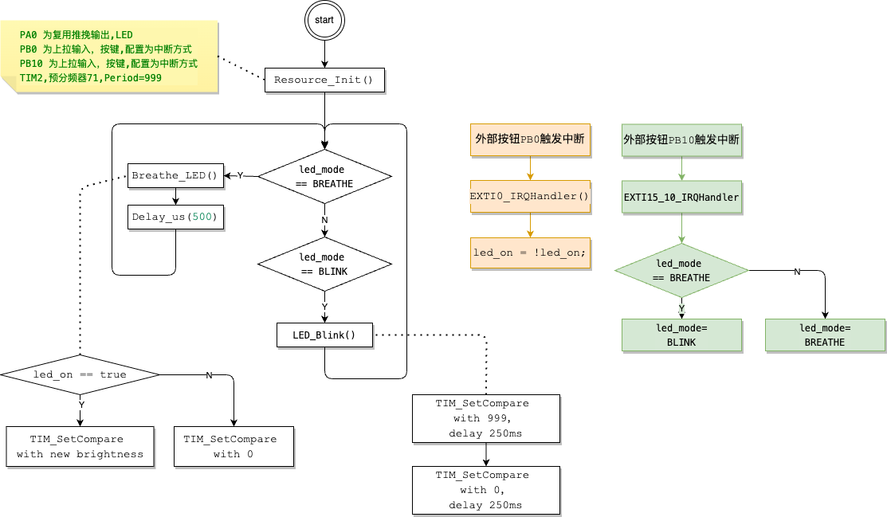

# LED闪烁模式


• ⽬标：使⽤ PWM 控制 LED 以2Hz频率闪烁（对每次闪烁中的亮灯时⻓不做要求），  
  并新加⼊⼀个 按键2 实现呼吸灯和闪烁模式的切换。要求使⽤外部中断来实现 按键 的功能  
• 提⽰：使⽤ 按键 触发外部中断，在外部中断中实现两种模式的切换  

• 问题：  
◦ 外部中断⼤致的配置流程是怎样的？  
◦ 按键 是如何实现外部中断的？  
◦ 如何在外部中断中实现两种模式的切换？  

---

## 硬件连接
   - **2个LED**：分别连接到 `PA0` 和 `PA1` 引脚。
   - **按键1**：连接到 `PB0` 引脚，用作控制 LED 呼吸灯的开关。
   - **按键2**：连接到 `PB10` 引脚，用作切换LED工作模式。
   
## LED 以2Hz频率闪烁
每秒闪烁2次，如下时序可以达到要求
`亮 -> delay 250ms -> 灭 -> delay 250ms`
`亮 -> delay 250ms -> 灭 -> delay 250ms`

```c
void LED_Blink(void)
{
    TIM_SetCompare1(TIM2, 999); // LED1 亮
    TIM_SetCompare2(TIM2, 999); // LED2 亮
    Delay_us(200 * 1000);       // Delay_us函数最大支持233ms,这里需要delay 250ms,分2步做delay
    Delay_us(50 * 1000);

    TIM_SetCompare1(TIM2, 0); // LED1 灭
    TIM_SetCompare2(TIM2, 0); // LED2 灭
    Delay_us(200 * 1000);
    Delay_us(50 * 1000);
}
```

## 流程图

---

## 问题
Q1:外部中断⼤致的配置流程是怎样的？
Q2:按键 是如何实现外部中断的？
Q3:如何在外部中断中实现两种模式的切换？

这3个问题下面用PB10的配置和中断处理回答
步骤:
**开启时钟：为 GPIO 和 AFIO 开启时钟。**
```c
    RCC_APB2PeriphClockCmd(RCC_APB2Periph_GPIOA | RCC_APB2Periph_GPIOB, ENABLE);
    RCC_APB2PeriphClockCmd(RCC_APB2Periph_AFIO, ENABLE); /*使能 AFIO 时钟*/
```
**配置 GPIO：设置中断引脚为输入模式。**
```c
    UTIL_GPIO_CFG(GPIOB, GPIO_Pin_10, GPIO_Speed_50MHz, GPIO_Mode_IPU);  /*PB10 为上拉输入，用于按键输入,BUTTON*/
```
**选择 PB10 作为中断源**
```c
    GPIO_EXTILineConfig(GPIO_PortSourceGPIOB, GPIO_PinSource10); /*选择 PB10 作为中断源*/
```
**配置 EXTI：设置触发模式和启用 EXTI 线。**
```c
   UTIL_EXTI_CFG(EXTI_Line10,
                  EXTI_Mode_Interrupt, EXTI_Trigger_Falling, ENABLE); /*EXTI_Line10 与 GPIO 的第 10 号引脚（PA10、PB10 等）相互对应*/
```
**配置 NVIC：使能 NVIC 中断通道并设置优先级。**
```c
    UTIL_NVIC_CFG(EXTI15_10_IRQn, 0, 0, ENABLE);                      /*PreemptionPriority=0; SubPriority=0*/
```
**编写中断处理函数：处理中断并清除挂起位。**
```c
/**PB10 中断处理*/
void EXTI15_10_IRQHandler(void)
{
    if (EXTI_GetITStatus(EXTI_Line10) != RESET)
    {
        if (led_mode == BREATHE) /*切换模式*/
            led_mode = BLINK;
        else
            led_mode = BREATHE;

        EXTI_ClearITPendingBit(EXTI_Line10); /*清除中断标志*/
    }
}
```

---

## 核心代码
```c
#include "stm32f10x.h"  // Device header
#include "stm32_util.h" // My Utility

const static uint8_t Positive = 0; /*LED变亮常量*/
const static uint8_t Negative = 1; /*LED变暗常量*/
const static uint8_t BLINK = 0;    /*闪烁常量*/
const static uint8_t BREATHE = 1;  /*呼吸常量*/

static uint8_t led_on = 1;              /*LED 开关状态*/
static uint16_t brightness = 0;         /*LED 当前的亮度*/
static uint8_t breathing_direction = 0; /*呼吸灯的方向*/
static uint8_t led_mode = BREATHE;      /*LED当前的运行方式*/

void LED_Blink(void);

void Resource_Init(void)
{
    /*GPIO 配置 START----------------------------------------------------------------------------------------*/
    RCC_APB2PeriphClockCmd(RCC_APB2Periph_GPIOA | RCC_APB2Periph_GPIOB, ENABLE);

    UTIL_GPIO_CFG(GPIOA, GPIO_Pin_0, GPIO_Speed_50MHz, GPIO_Mode_AF_PP); /*PA0 为复用推挽输出，用于 PWM 输出,LED*/
    UTIL_GPIO_CFG(GPIOA, GPIO_Pin_1, GPIO_Speed_50MHz, GPIO_Mode_AF_PP); /*PA1 为复用推挽输出，用于 PWM 输出,LED*/
    UTIL_GPIO_CFG(GPIOB, GPIO_Pin_0, GPIO_Speed_50MHz, GPIO_Mode_IPU);   /*PB0 为上拉输入，用于按键输入,BUTTON*/
    UTIL_GPIO_CFG(GPIOB, GPIO_Pin_10, GPIO_Speed_50MHz, GPIO_Mode_IPU);  /*PB10 为上拉输入，用于按键输入,BUTTON*/
    /*GPIO 配置 END------------------------------------------------------------------------------------------*/

    /*TIM 配置 START------------------------------------------------------------------------------------------*/
    /*TIM2 属于低速定时器，时钟源来自于 APB1 总线，通过 APB1 外设时钟使能*/
    RCC_APB1PeriphClockCmd(RCC_APB1Periph_TIM2, ENABLE);
    /*
     * 配置定时器基本参数,目标是 TIM2
     * STM32 的时钟频率为72 MHz，预分频器通常设为 71
     * Period=999 自动重装载值,选择 1kHz的PWM频率，这样在1s内可以有1000个调节点
     * Prescaler=71
     * TIM_CKD_DIV1 设置定时器不进行任何时钟分频，使其直接使用原始时钟频率。对于精确的时间计数或者快速响应的应用场景.
     * TIM_CounterMode_Up :设置定时器的计数模式为向上计数模式
     */
    UTIL_TIM_BASE_CFG(TIM2, 999, 71, TIM_CKD_DIV1, TIM_CounterMode_Up);

    /*
     * 配置 PWM 模式;目标是 TIM2_CH1/2 设置为TIM_OCMode_PWM1模式，OCMode(Output Compare Mode)
     *
     * Channel 和 GPIO 的对应关系如下：
     * TIM2_CH1 => PA0;TIM2_CH2 => PA1;TIM2_CH3 => PA2;TIM2_CH4 => PA3
     *
     * TIM_OCMode       = TIM_OCMode_PWM1;在 PWM模式1下，输出比较寄存器(CCR)的值决定了信号的占空比
     * State=TIM_OutputState_Enable;TIM_Pulse=0;OCPolarity=TIM_OCPolarity_High
     */
    UTIL_TIM_PWM_CFG(TIM2, 1, /*PA0*/ TIM_OCMode_PWM1, TIM_OutputState_Enable, 0, TIM_OCPolarity_High);

    UTIL_TIM_PWM_CFG(TIM2, 2, /*PA1*/ TIM_OCMode_PWM1, TIM_OutputState_Enable, 0, TIM_OCPolarity_High);

    TIM_Cmd(TIM2, ENABLE); /* 启动 TIM2*/
    /*TIM 配置 END----------------------------------------------------------------------------------------------*/

    /*中断配置 START---------------------------------------------------------------------------------------------*/
    RCC_APB2PeriphClockCmd(RCC_APB2Periph_AFIO, ENABLE); /*使能 AFIO 时钟*/

    GPIO_EXTILineConfig(GPIO_PortSourceGPIOB, GPIO_PinSource0);       /*选择 PB0 作为中断源*/
    UTIL_EXTI_CFG(EXTI_Line0,                                         /*EXTI_Line0 与 GPIO 的第 0 号引脚（PA0、PB0 等）相互对应*/
                  EXTI_Mode_Interrupt, EXTI_Trigger_Falling, ENABLE); /*Mode=Interrupt; Trigger=Falling下降沿触发;*/
    UTIL_NVIC_CFG(EXTI0_IRQn, 0, 0, ENABLE);                          /*配置中断优先级, 处理来自 GPIO 引脚 0（如 PA0、PB0）的中断事件*/

    GPIO_EXTILineConfig(GPIO_PortSourceGPIOB, GPIO_PinSource10); /*选择 PB10 作为中断源*/
    UTIL_EXTI_CFG(EXTI_Line10,
                  EXTI_Mode_Interrupt, EXTI_Trigger_Falling, ENABLE); /*EXTI_Line10 与 GPIO 的第 10 号引脚（PA10、PB10 等）相互对应*/
    UTIL_NVIC_CFG(EXTI15_10_IRQn, 0, 0, ENABLE);                      /*PreemptionPriority=0; SubPriority=0*/

    UTIL_NVIC_CFG(TIM3_IRQn, 0, 0, ENABLE); /*使能 TIM3 中断通道*/
    /*中断配置 END-----------------------------------------------------------------------------------------------*/
}

void EXTI0_IRQHandler(void)
{
    if (EXTI_GetITStatus(EXTI_Line0) != RESET)
    {
        led_on = !led_on;                   /* 切换 LED 开关状态*/
        EXTI_ClearITPendingBit(EXTI_Line0); /* 清除中断标志*/
    }
}

/**PB10 中断处理*/
void EXTI15_10_IRQHandler(void)
{
    if (EXTI_GetITStatus(EXTI_Line10) != RESET)
    {
        if (led_mode == BREATHE) /*切换模式*/
            led_mode = BLINK;
        else
            led_mode = BREATHE;

        EXTI_ClearITPendingBit(EXTI_Line10); /*清除中断标志*/
    }
}

void LED_Blink(void)
{
    TIM_SetCompare1(TIM2, 999); // LED1 亮
    TIM_SetCompare2(TIM2, 999); // LED2 亮
    Delay_us(200 * 1000);       // Delay_us函数最大支持233ms,这里需要delay 250ms,分2步做delay
    Delay_us(50 * 1000);

    TIM_SetCompare1(TIM2, 0); // LED1 灭
    TIM_SetCompare2(TIM2, 0); // LED2 灭
    Delay_us(200 * 1000);
    Delay_us(50 * 1000);
}

void Breathe_LED(void)
{
    if (led_on)
    {
        if (breathing_direction == Positive)
        {
            brightness++;
            if (brightness >= 999)
                breathing_direction = Negative;
        }
        else
        {
            brightness--;
            if (brightness == 0)
                breathing_direction = Positive;
        }

        TIM_SetCompare1(TIM2, brightness); /*调整 TIM2 通道 1 的比较值，改变占空比*/
        TIM_SetCompare2(TIM2, brightness); /*调整 TIM2 通道 2 的比较值，改变占空比*/
    }
    else
    {
        TIM_SetCompare1(TIM2, 0); /*如果 LED 关闭，PWM 输出最小值*/
        TIM_SetCompare2(TIM2, 0);
    }
}

int main(void)
{
    Resource_Init();

    while (1)
    {
        if (led_mode == BREATHE)
        {
            Breathe_LED(); /*控制 LED 呼吸灯*/

            Delay_us(500); /**
                            * 目标是：1s 完成呼吸一次，暗变亮->亮变暗,
                            * 调整呼吸速度, main函数中 0.5ms(毫秒) 调度一次 Breathe_LED()
                            * 1s 调度2000次，占空比的变化是: 0->999 然后 999->0
                            */
        }
        else if (led_mode == BLINK)
        {
            LED_Blink();
        }
    }
}
```