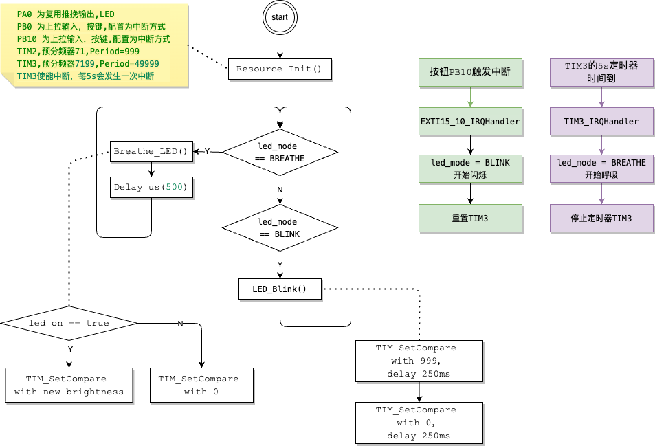

# LED模式定时⾃动切换


• ⽬标：修改你的程序，按下 按键2 后 5s 内 LED 闪烁，之后⾃动切换为呼吸灯模式  
• 提⽰：使⽤ TIM 的定时中断功能来实现 LED 闪烁  

• 问题：
◦ 简要介绍⼀下 TIM 定时中断的⼯作流程  
◦ 如何实现模式之间的⾃动切换？  

---

## 硬件连接
   - **2个LED**：分别连接到 `PA0` 和 `PA1` 引脚。
   - **按键1**：连接到 `PB0` 引脚，用作控制 LED 呼吸灯的开关。
   - **按键2**：连接到 `PB10` 引脚，用作切换LED工作模式。

## 新增TIM3的配置
配置 TIM3，每 5 秒触发一次中断,初始是DISABLE状态，等待PB10的触发。
```c
RCC_APB1PeriphClockCmd(RCC_APB1Periph_TIM3, ENABLE); /*使能 TIM3 时钟*/
/**
 * Prescaler = 7199 将时钟频率从 72 MHz 降低到10,000Hz = (72,000,000)/(7199+1)
 * 定时器的频率是 10 kHz（每秒钟计数 10,000 次）
 * 为了实现 5秒 的定时，定时器需要在 5 秒 内计数 5秒×10,000Hz=50,000次
 * 因此，自动重装载值（ARR）应设置为 50,000 - 1 = 49999。
 */
UTIL_TIM_BASE_EX(TIM3, 49999, 7199, DIV1, Up); /*配置 TIM3，每 5 秒触发一次中断*/
TIM_ITConfig(TIM3, TIM_IT_Update, ENABLE);     /*启用 TIM3 更新中断*/
TIM_ClearITPendingBit(TIM3, TIM_IT_Update);    /*初始化时清除定时器中断标志，防止错误触发中断*/
TIM_Cmd(TIM3, DISABLE);                        /*不启动TIM3*/
```

## 按键2(PB10)的中断处理
切换LED模式为闪烁模式, 让TIM3从0开始计数，然后启用TIM3.
```c
/**按键 2 切换模式*/ 
void EXTI15_10_IRQHandler(void)
{
    if (EXTI_GetITStatus(EXTI_Line10) != RESET)
    {
        led_mode = BLINK;

        TIM_Cmd(TIM3, DISABLE);  /*停止定时器以确保重置*/
        TIM_SetCounter(TIM2, 0); /*重置计数器为0*/
        TIM_Cmd(TIM3, ENABLE);   /*重新启动定时器，开始新的5秒计时*/

        EXTI_ClearITPendingBit(EXTI_Line10); // 清除中断标志
    }
}
```

## 流程图


<BR><BR><BR>
---

## Q1:简要介绍⼀下 TIM 定时中断的⼯作流程
**TIM（定时器）定时中断**是 STM32 微控制器中的一项重要功能，允许开发者通过定时器来触发特定时间间隔的中断，从而执行定时操作。其工作流程通常分为以下几个步骤：

### 1. **配置定时器时钟**
定时器使用的时钟来源可以是内部时钟（如 APB1、APB2 时钟），首先需要使能定时器的时钟源，确保定时器有输入时钟。例如：
```c
RCC_APB1PeriphClockCmd(RCC_APB1Periph_TIM3, ENABLE); /*使能 TIM3 时钟*/
```

### 2. **配置预分频器（Prescaler）和自动重装载寄存器（ARR）**
定时器的输入时钟通常很高（如 72 MHz），因此通过预分频器将时钟降低到可控的频率。然后，通过设置自动重装载寄存器（ARR）来决定定时器的计数周期。举例来说，如果时钟频率是 72 MHz，预分频器设置为 7199，那么定时器的时钟频率为 10 kHz。

```c
UTIL_TIM_BASE_EX(TIM3, 49999, 7199, DIV1, Up); /*配置 TIM3，每 5 秒触发一次中断*/
TIM_ClearITPendingBit(TIM3, TIM_IT_Update);    /*初始化时清除定时器中断标志，防止错误触发中断
```

### 3. **启动定时器和使能中断**
设置完时钟后，启动定时器，并使能更新中断（TIM_IT_Update），这样在定时器达到计数值后触发中断。

```c
TIM_ITConfig(TIM3, TIM_IT_Update, ENABLE);     /*启用 TIM3 更新中断*/
TIM_Cmd(TIM3, ENABLE);  // 启动定时器
```

### 4. **配置 NVIC（嵌套向量中断控制器）**
为了响应定时器的中断，必须在 NVIC 中配置对应的中断源（如 TIM2_IRQn），并设置其优先级。

```c
UTIL_NVIC_CFG(TIM3_IRQn, 0, 0, ENABLE); /*使能 TIM3 中断通道*/
```

### 5. **编写中断处理函数**
在定时器中断发生时，中断处理函数将被调用。在这里，你可以执行任何需要定时执行的任务。在处理完任务后，需要清除中断标志位，以防止中断再次触发。

```c
/**TIM3 中断处理*/ 
void TIM3_IRQHandler(void)
{
    if (TIM_GetITStatus(TIM3, TIM_IT_Update) != RESET)
    {
        led_mode = BREATHE;
        TIM_Cmd(TIM3, DISABLE); // 停止定时器以确保重置
        TIM_ClearITPendingBit(TIM3, TIM_IT_Update);
    }
}
```


### 总结：
TIM 定时中断的工作流程大致分为以下步骤：
1. **初始化时钟和定时器**。
2. **设置预分频器和计数周期**。
3. **使能定时器更新中断并启动定时器**。
4. **配置 NVIC 响应中断**。
5. **在中断处理函数中执行定时任务，并清除中断标志位**。

---

## Q2:如何实现模式之间的⾃动切换？
main 函数负责根据不同的模式工作,按键2(PB10)的中断处理先把模式切位`BLINK`，再启用TIM3的5s定时器，此时LED是闪烁状态,5s后TIM3的中断处理来了，此时把模式切位`BREATHE`,main函数就开始进入呼吸模式了，每次按下PB10都会重新开始计数.
```c
int main(void)
{
    Resource_Init();

    while (1)
    {
        if (led_mode == BREATHE)
        {
            Breathe_LED(); /*控制 LED 呼吸灯*/
            Delay_us(500); /**
                            * 目标是：1s 完成呼吸一次，暗变亮->亮变暗,
                            * 调整呼吸速度, main函数中 0.5ms(毫秒) 调度一次 Breathe_LED()
                            * 1s 调度2000次，占空比的变化是: 0->999 然后 999->0
                            */
        }
        else if (led_mode == BLINK)
        {
            LED_Blink();
        }
    }
}
```