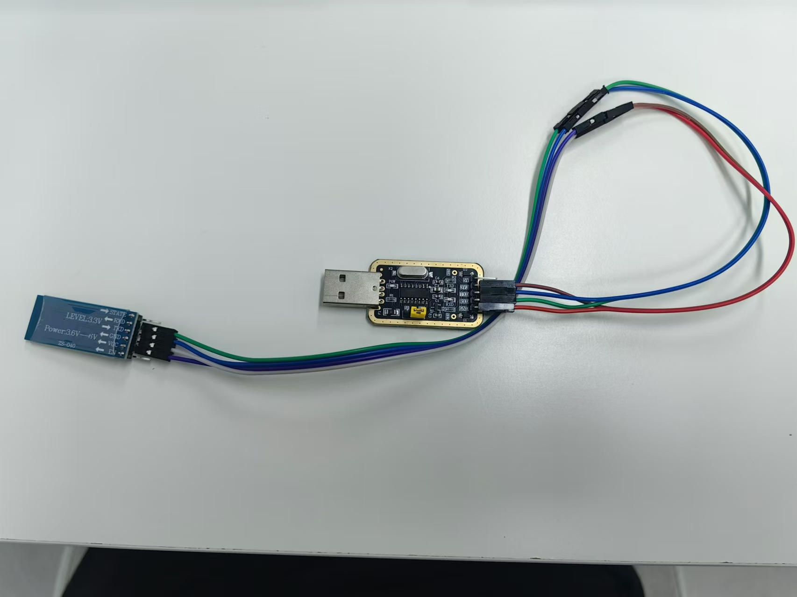

# 驱动蓝⽛
• ⽬标：驱动 蓝⽛模块 并完成初步的配置
• 提⽰：使⽤ USB转串⼝模块 以及 AT指令 对 蓝⽛模块 进⾏初步配置（PC端需要下载串⼝调试软
件且上位机要下载与 蓝⽛模块 对应的调试软件）  

• 问题：
◦ 如何使⽤ AT指令 对 蓝⽛模块 进⾏配置？

---
## 硬件连接
PC 端使用USB转串口 (USB <=> TTL), PC端需要安装`USB转串口CH340驱动` USBTTL接入后确保设备管理器的串行设备下的串口设备没有显示感叹号.  

蓝牙模块是`HC-05` 

**CH340 TXD (发送引脚)** ↔ **HC-05 RXD (接收引脚)**  
   - CH340 的 TXD 引脚（发送数据）连接到 HC-05 的 RXD 引脚（接收数据），这是数据的发送与接收通道。

**CH340 RXD (接收引脚)** ↔ **HC-05 TXD (发送引脚)**  
   - CH340 的 RXD 引脚（接收数据）连接到 HC-05 的 TXD 引脚（发送数据），这是数据的接收与发送通道。

**CH340 GND (地)** ↔ **HC-05 GND (地)**  
   - 两者的 GND 引脚连接在一起，确保两者有共同的电气基准，避免信号误差。

**CH340 3.3V** ↔ **HC-05 VCC (电源引脚)**  
   - 根据 HC-05 模块的要求，通常 VCC 电源为 3.3V 或 5V

## AT指令
蓝牙模块的 AT 指令用于配置蓝牙模块（例如 HC-05 或 HC-06）的工作模式、设备名称、波特率等参数。HC-05 和 HC-06 都支持 AT 指令，但 HC-05 支持更多的命令。

以下是一些常见的蓝牙模块 AT 指令及其用途：

### **1. 基本 AT 指令**

#### 1.1 测试 AT 连接
- **命令**: `AT`
- **说明**: 测试蓝牙模块是否进入 AT 模式，返回 `OK` 表示 AT 模式正常工作。

#### 1.2 查看版本信息
- **命令**: `AT+VERSION?`
- **说明**: 查询蓝牙模块的固件版本。

#### 1.3 重启模块
- **命令**: `AT+RESET`
- **说明**: 重启蓝牙模块。

### **2. 配置类 AT 指令**

#### 2.1 设置蓝牙名称
- **命令**: `AT+NAME=xxxx`
- **说明**: 设置蓝牙设备的名称为 `xxxx`。可以将 `xxxx` 替换为任何字符串，例如 `HC05`.
  - 例子: `AT+NAME=MyBluetooth`

#### 2.2 查询当前设备名称
- **命令**: `AT+NAME?`
- **说明**: 查询当前设置的蓝牙名称。

#### 2.3 设置波特率
- **命令**: `AT+UART=baudrate,stop bits,parity`
- **说明**: 设置蓝牙串口的波特率、停止位和校验位。
  - 例子: `AT+UART=9600,1,0` 设置波特率为 9600，1 个停止位，无校验。

#### 2.4 查询当前波特率
- **命令**: `AT+UART?`
- **说明**: 查询当前配置的串口波特率。

#### 2.5 设置蓝牙工作模式（仅 HC-05 支持）
- **命令**: `AT+ROLE=x`
- **说明**: 设置蓝牙模块的角色。`x` 的取值为：
  - `0`：从机（Slave）
  - `1`：主机（Master）
  - `2`：循环模式（Loopback）
  - 例子: `AT+ROLE=0` 将蓝牙模块设置为从机模式。

#### 2.6 查询当前角色
- **命令**: `AT+ROLE?`
- **说明**: 查询当前蓝牙模块的角色。

#### 2.7 设置密码（配对码）
- **命令**: `AT+PSWD=xxxx`
- **说明**: 设置蓝牙模块的配对密码，`xxxx` 为 4 位数的密码（默认是 `1234`）。
  - 例子: `AT+PSWD=5678` 设置配对密码为 `5678`。

#### 2.8 查询当前密码
- **命令**: `AT+PSWD?`
- **说明**: 查询当前蓝牙模块的配对密码。

### **3. 连接相关 AT 指令**

#### 3.1 设置蓝牙可见性（仅 HC-05 支持）
- **命令**: `AT+CMODE=x`
- **说明**: 设置蓝牙连接模式：
  - `0`：连接指定地址的设备（点对点）
  - `1`：允许与任何地址的设备配对（默认）
  - 例子: `AT+CMODE=1` 允许与任何设备配对。

#### 3.2 绑定蓝牙设备（仅 HC-05 支持）
- **命令**: `AT+BIND=address`
- **说明**: 绑定一个指定的蓝牙设备地址，`address` 为设备的 MAC 地址。
  - 例子: `AT+BIND=0011,22,33AA` 绑定一个 MAC 地址为 `00:11:22:33:AA` 的设备。

#### 3.3 查询绑定设备
- **命令**: `AT+BIND?`
- **说明**: 查询当前绑定的蓝牙设备地址。

#### 3.4 断开连接
- **命令**: `AT+DISC`
- **说明**: 断开当前的蓝牙连接。

### **4. 其他有用的指令**

#### 4.1 恢复出厂设置
- **命令**: `AT+ORGL`
- **说明**: 恢复蓝牙模块的出厂设置。

#### 4.2 查询模块地址
- **命令**: `AT+ADDR?`
- **说明**: 查询蓝牙模块的 MAC 地址。

#### 4.3 设置蓝牙设备的类别（仅 HC-05 支持）
- **命令**: `AT+CLASS=x`
- **说明**: 设置蓝牙设备的类别，`x` 为类别代码。
  - 例子: `AT+CLASS=0` 将蓝牙设备的类别设置为默认值。

### **HC-05 进入 AT 模式**
要将 HC-05 模块切换到 AT 模式，一般步骤如下：
1. 将蓝牙模块的 `EN` 或 `KEY` 引脚拉高（接 3.3V）。
2. 上电或复位模块。
3. 使用串口工具以设置的波特率（默认 38400 bps）发送 AT 指令。

---

## Q:如何使⽤ AT指令 对 蓝⽛模块 进⾏配置？
确认硬件已经连接好，按住蓝牙模块上的复位键，把USBTTL 插入到PC，此时蓝牙模块的指示灯是慢速闪烁模式，通常是2s闪烁一次，这就表示蓝牙模块已经进入了AT 模式。

PC上用串口工具配置蓝牙
PC上打开`串口助手 V1.1`,选择好COM口，其他的配置如下:
波特率：38400
数据位：8
停止位：1
校验位：无

接收模式：文本模式
发送模式：文本模式

在发送区输入AT，然后回车换行，点击按钮发送就完成了一次蓝牙的AT交互。

我们把蓝牙的名字改成 DEAD-05
命令是: `AT+NAME=DEAD-05` 回车换行，点击发送按钮。

