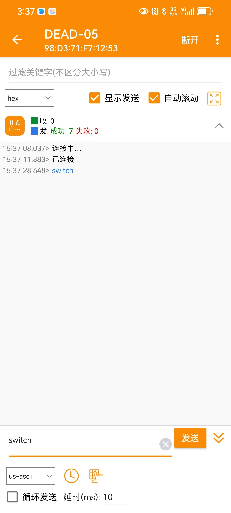

# 蓝⽛通信

• ⽬标：利⽤上位机向 蓝⽛ 发送数据代替 四 中 按键 ，并将接收到的数据显⽰在 OLED屏幕 上
• 提⽰：⾃定义数据包格式以实现多字节数据的接收与处理

• 问题：
◦   蓝⽛ 与单⽚机交流使⽤的是什么通信协议？简要介绍⼀下这个通信协议
◦   如何在 蓝⽛模块 接收到消息时⽴即处理？

---
## 硬件连接
连接 HC-05 到 STM32 的 USART1 引脚,参考引脚定义文档得知，USART1 TX RX 对应的是PA9 PA10 .
```
PA9 	I/O 	FT 	PA9 	USART1_TX/TIM1_CH2
PA10 	I/O 	FT 	PA10 	USART1_RX/TIM1_CH3
```
**HC-05 TXD ↔ STM32 PA10 (USART1 RX 引脚)**
-   HC-05 的 TXD 引脚连接到 STM32 的 PA10（USART1 的 RX 引脚），用于接收来自 HC-05 的数据。

**HC-05 RXD ↔ STM32 PA9 (USART1 TX 引脚)**
-   HC-05 的 RXD 引脚连接到 STM32 的 PA9（USART1 的 TX 引脚），用于发送数据到 HC-05。

**HC-05 VCC ↔ STM32 3.3V 或 5V 电源**
-   连接到 STM32 的 3.3V 或 5V 电源。

**HC-05 GND ↔ STM32 GND**
-   连接到 STM32 的 GND 引脚。


## ⾃定义数据包格式以实现多字节数据的接收与处理
数据包的格式是`cmd\n`,就是命令后面跟一个换行符`\n`, e.g. `switch\n`

## 配置USART（串口）
```c
/*UART START-----------------------------------------------------------------------------------------------*/
UTIL_USART_CFG(9600, USART_WordLength_8b, USART_StopBits_1, USART_Parity_No, //
                USART_HardwareFlowControl_None, USART_Mode_Rx | USART_Mode_Tx);
USART_Cmd(USART1, ENABLE);
USART_ITConfig(USART1, USART_IT_RXNE, ENABLE); /*使能 USART1 接收中断*/

UTIL_NVIC_CFG(USART1_IRQn, 1, 1, ENABLE); /*配置 NVIC，处理 UART 中断*/
/*UART END-------------------------------------------------------------------------------------------------*/
```

## 串口中断处理
```c
/*串口中断处理*/
void USART1_IRQHandler(void)
{
    // 检查是否是接收中断
    if (USART_GetITStatus(USART1, USART_IT_RXNE) != RESET)
    {
        char receivedChar = USART_ReceiveData(USART1); /*读取接收到的数据 */
        rxBuffer[bufferIndex++] = receivedChar;        /*将接收到的数据存入缓冲区*/

        if (receivedChar == '\n') /*如果接收到换行符，认为数据包结束*/
        {
            rxBuffer[bufferIndex - 1] = '\0'; /* 把\n替换成\0结束符 */
            bufferIndex = 0;                  /* 重置缓冲区索引 */

            ProcessReceivedData(); /*处理接收到的完整数据包*/
        }
    }
}

/*处理蓝牙通过串口发送过来的数据*/
void ProcessReceivedData(void)
{
    char *pt_recv = rxBuffer;
    if (strncmp(pt_recv, "switch", 6) == 0)
    {
        led_mode = BLINK;

        TIM_Cmd(TIM3, DISABLE);  /*停止定时器以确保重置*/
        TIM_SetCounter(TIM2, 0); /*重置计数器为0*/
        TIM_Cmd(TIM3, ENABLE);   /*重新启动定时器，开始新的5秒计时*/
    }
}
```
---

## Q1:蓝⽛ 与单⽚机交流使⽤的是什么通信协议？简要介绍⼀下这个通信协议
蓝牙与单片机之间的通信通常使用**UART 通用异步收发传输器**协议。UART 是一种广泛应用的串行通信协议，在单片机和蓝牙模块（如 HC-05、HC-06）之间经常使用。

### 简要介绍 UART 协议：

1. **异步通信**：UART 不需要共享的时钟信号，发送和接收方只需约定好相同的波特率（数据传输速率），就能实现数据的同步和传输。

2. **全双工通信**：UART 支持同时进行数据的发送和接收。蓝牙模块的 TX（发送）引脚连接到单片机的 RX（接收）引脚，蓝牙模块的 RX 引脚连接到单片机的 TX 引脚，实现双向数据传输。

3. **数据帧结构**：
   - 每个数据帧由起始位、数据位（通常是 8 位）、校验位（可选）、停止位构成。
   - 起始位通知接收端数据传输的开始。
   - 数据位是实际传输的数据。
   - 校验位可以检查数据传输是否有错误。
   - 停止位标志数据帧的结束。

4. **简单性和广泛性**：UART 不需要复杂的同步时钟线，只使用两条数据线（TX 和 RX）即可实现通信，因此其硬件实现简单，适合在单片机和蓝牙模块之间建立短距离的无线通信。

通过 UART，蓝牙模块可以将接收到的无线数据发送给单片机，单片机也可以通过 UART 将数据发送到蓝牙模块，从而实现与其他设备的通信。

## Q2:如何在 蓝⽛模块 接收到消息时⽴即处理？
通过串口中断

---


## 核心代码
```c
/**
 *
 * 目标:利⽤上位机(手机)向蓝⽛发送数据 ，并将接收到的数据显⽰在 OLED屏幕 上
 * 数据包格式是command+\n; e.g. "switch\n"
 *
 */
#include <string.h>
#include "stm32f10x.h"  // Device header
#include "stm32_util.h" // My Utility

const static uint8_t Positive = 0; /*LED变亮常量*/
const static uint8_t Negative = 1; /*LED变暗常量*/
const static uint8_t BLINK = 0;    /*闪烁常量*/
const static uint8_t BREATHE = 1;  /*呼吸常量*/

static uint8_t led_on = 1;              /*LED 开关状态*/
static uint16_t brightness = 0;         /*LED 当前的亮度*/
static uint8_t breathing_direction = 0; /*呼吸灯的方向*/
static uint8_t led_mode = BREATHE;      /*LED当前的运行方式*/
static char rxBuffer[256] = {0};        /*receive buffer*/
static int bufferIndex = 0;

void LED_Blink(void);
void ProcessReceivedData(void);
void Resource_Init(void)
{
    /*GPIO 配置 START----------------------------------------------------------------------------------------*/
    RCC_APB2PeriphClockCmd(RCC_APB2Periph_GPIOA | RCC_APB2Periph_GPIOB | RCC_APB2Periph_USART1,
                           ENABLE);

    /*利用宏拼接的简洁写法*/
    UTIL_GPIO_CFG_EX(A, 0, 50MHz, AF_PP); /*PA0 为复用推挽输出，用于 PWM 输出,LED*/
    UTIL_GPIO_CFG_EX(A, 1, 50MHz, AF_PP); /*PA1 为复用推挽输出，用于 PWM 输出,LED*/
    UTIL_GPIO_CFG_EX(B, 0, 50MHz, IPU);   /*PB0 为上拉输入，用于按键输入,BUTTON*/
    UTIL_GPIO_CFG_EX(B, 10, 50MHz, IPU);  /*PB10 为上拉输入，用于按键输入,BUTTON*/

    UTIL_GPIO_CFG_EX(A, 9, 50MHz, AF_PP);        /*配置 PA9 (TX)*/
    UTIL_GPIO_CFG_EX(A, 10, 50MHz, IN_FLOATING); /*配置 PA10 (RX)*/
    /*GPIO 配置 END------------------------------------------------------------------------------------------*/

    /*TIM 配置 START------------------------------------------------------------------------------------------*/
    /*TIM2 属于低速定时器，时钟源来自于 APB1 总线，通过 APB1 外设时钟使能*/
    RCC_APB1PeriphClockCmd(RCC_APB1Periph_TIM2, ENABLE);

    UTIL_TIM_BASE_EX(TIM2, 999, 71, DIV1, Up); /*配置定时器基本参数,目标是 TIM2*/

    /* 配置TIM2 PWM 模式;目标是 TIM2_CH1/2 设置为TIM_OCMode_PWM1模式，OCMode(Output Compare Mode) */
    UTIL_TIM_PWM_EX(TIM2, 1, /*PA0*/ PWM1, Enable, 0, High); /*TIM2_CH1 <=> PA0*/
    UTIL_TIM_PWM_EX(TIM2, 2, /*PA1*/ PWM1, Enable, 0, High); /*TIM2_CH2 <=> PA1*/

    TIM_Cmd(TIM2, ENABLE); /* 启动 TIM2*/

    RCC_APB1PeriphClockCmd(RCC_APB1Periph_TIM3, ENABLE); /*使能 TIM3 时钟*/
    /**
     * Prescaler = 7199 将时钟频率从 72 MHz 降低到10,000Hz = (72,000,000)/(7199+1)
     * 定时器的频率是 10 kHz（每秒钟计数 10,000 次）
     * 为了实现 5秒 的定时，定时器需要在 5 秒 内计数 5秒×10,000Hz=50,000次
     * 因此，自动重装载值（ARR）应设置为 50,000 - 1 = 49999。
     */
    UTIL_TIM_BASE_EX(TIM3, 49999, 7199, DIV1, Up); /*配置 TIM3，每 5 秒触发一次中断*/
    TIM_ITConfig(TIM3, TIM_IT_Update, ENABLE);     /*启用 TIM3 更新中断*/
    TIM_ClearITPendingBit(TIM3, TIM_IT_Update);    /*初始化时清除定时器中断标志，防止错误触发中断*/
    TIM_Cmd(TIM3, DISABLE);                        /*不启动TIM3*/
    /*TIM 配置 END----------------------------------------------------------------------------------------------*/

    /*UART START-----------------------------------------------------------------------------------------------*/
    UTIL_USART_CFG(9600, USART_WordLength_8b, USART_StopBits_1, USART_Parity_No, //
                   USART_HardwareFlowControl_None, USART_Mode_Rx | USART_Mode_Tx);
    USART_Cmd(USART1, ENABLE);
    USART_ITConfig(USART1, USART_IT_RXNE, ENABLE); /*使能 USART1 接收中断*/

    UTIL_NVIC_CFG(USART1_IRQn, 1, 1, ENABLE); /*配置 NVIC，处理 UART 中断*/
    /*UART END-------------------------------------------------------------------------------------------------*/

    /*中断配置 START---------------------------------------------------------------------------------------------*/
    RCC_APB2PeriphClockCmd(RCC_APB2Periph_AFIO, ENABLE); /*使能 AFIO 时钟*/

    GPIO_EXTILineConfig(GPIO_PortSourceGPIOB, GPIO_PinSource0); /*选择 PB0 作为中断源*/
    UTIL_EXTI_EX(0, Interrupt, Falling, ENABLE);                /*EXTI_Line0 <==> (PA0、PB0);Interrupt;下降沿触发*/
    UTIL_NVIC_CFG(EXTI0_IRQn, 0, 0, ENABLE);                    /*配置中断优先级, 处理来自 GPIO 引脚 0（如 PA0、PB0）的中断事件*/

    GPIO_EXTILineConfig(GPIO_PortSourceGPIOB, GPIO_PinSource10); /*选择 PB10 作为中断源*/
    UTIL_EXTI_EX(10, Interrupt, Falling, ENABLE);                /*EXTI_Line0 <==> (PA10、PB10);Interrupt;下降沿触发*/
    UTIL_NVIC_CFG(EXTI15_10_IRQn, 0, 0, ENABLE);                 /*PreemptionPriority=0; SubPriority=0*/

    UTIL_NVIC_CFG(TIM3_IRQn, 0, 0, ENABLE); /*使能 TIM3 中断通道*/
    /*中断配置 END-----------------------------------------------------------------------------------------------*/
}

void EXTI0_IRQHandler(void)
{
    if (EXTI_GetITStatus(EXTI_Line0) != RESET)
    {
        led_on = !led_on;                   // 切换 LED 开关状态
        EXTI_ClearITPendingBit(EXTI_Line0); // 清除中断标志
    }
}

/**按键 2 切换模式*/
void EXTI15_10_IRQHandler(void)
{
    if (EXTI_GetITStatus(EXTI_Line10) != RESET)
    {
        led_mode = BLINK;

        TIM_Cmd(TIM3, DISABLE);  /*停止定时器以确保重置*/
        TIM_SetCounter(TIM2, 0); /*重置计数器为0*/
        TIM_Cmd(TIM3, ENABLE);   /*重新启动定时器，开始新的5秒计时*/

        EXTI_ClearITPendingBit(EXTI_Line10); // 清除中断标志
    }
}

/**TIM3 中断处理*/
void TIM3_IRQHandler(void)
{
    if (TIM_GetITStatus(TIM3, TIM_IT_Update) != RESET)
    {
        led_mode = BREATHE;
        TIM_Cmd(TIM3, DISABLE); /* 停止定时器以确保重置 */
        TIM_ClearITPendingBit(TIM3, TIM_IT_Update);
    }
}

/*串口来数据的中断处理*/
void USART1_IRQHandler(void)
{
    // 检查是否是接收中断
    if (USART_GetITStatus(USART1, USART_IT_RXNE) != RESET)
    {
        char receivedChar = USART_ReceiveData(USART1); /*读取接收到的数据 */
        rxBuffer[bufferIndex++] = receivedChar;        /*将接收到的数据存入缓冲区*/

        if (receivedChar == '\n') /*如果接收到换行符，认为数据包结束*/
        {
            rxBuffer[bufferIndex - 1] = '\0'; /* 把\n替换成\0结束符 */
            bufferIndex = 0;                  /* 重置缓冲区索引 */

            ProcessReceivedData(); /*处理接收到的完整数据包*/
        }
    }
}

/*处理蓝牙通过串口发送过来的数据*/
void ProcessReceivedData(void)
{
    char *pt_recv = rxBuffer;
    if (strncmp(pt_recv, "switch", 6) == 0)
    {
        led_mode = BLINK;

        TIM_Cmd(TIM3, DISABLE);  /*停止定时器以确保重置*/
        TIM_SetCounter(TIM2, 0); /*重置计数器为0*/
        TIM_Cmd(TIM3, ENABLE);   /*重新启动定时器，开始新的5秒计时*/
    }
}

void LED_Blink(void)
{
    TIM_SetCompare1(TIM2, 999); // LED1 亮
    TIM_SetCompare2(TIM2, 999); // LED2 亮
    Delay_us(200 * 1000);       // Delay_us函数最大支持233ms,这里需要delay 250ms,分2步做delay
    Delay_us(50 * 1000);

    TIM_SetCompare1(TIM2, 0); // LED1 灭
    TIM_SetCompare2(TIM2, 0); // LED2 灭
    Delay_us(200 * 1000);
    Delay_us(50 * 1000);
}

void Breathe_LED(void)
{
    if (led_on)
    {
        if (breathing_direction == Positive)
        {
            brightness++;
            if (brightness >= 999)
                breathing_direction = Negative;
        }
        else
        {
            brightness--;
            if (brightness == 0)
                breathing_direction = Positive;
        }

        TIM_SetCompare1(TIM2, brightness); // 调整 TIM2 通道 1 的比较值，改变占空比
        TIM_SetCompare2(TIM2, brightness); // 调整 TIM2 通道 2 的比较值，改变占空比
    }
    else
    {
        // 如果 LED 关闭，停止 PWM 输出
        TIM_SetCompare1(TIM2, 0);
        TIM_SetCompare2(TIM2, 0);
    }
}

int main(void)
{
    Resource_Init();

    while (1)
    {
        if (led_mode == BREATHE)
        {
            Breathe_LED(); /*控制 LED 呼吸灯*/
            Delay_us(500); /**
                            * 目标是：1s 完成呼吸一次，暗变亮->亮变暗,
                            * 调整呼吸速度, main函数中 0.5ms(毫秒) 调度一次 Breathe_LED()
                            * 1s 调度2000次，占空比的变化是: 0->999 然后 999->0
                            */
        }
        else if (led_mode == BLINK)
        {
            LED_Blink();
        }
    }
}

```

## 测试
华为应用市场下载`SPP蓝牙串口`
之前我们已经把蓝牙名字修改成了`DEAD-05`,
打开SPP蓝牙串口软件，搜索 `DEAD-05`并连接，输入`switch换行`如下图，点击发送，可以观察到LED进入了5s的闪烁状态，然后切换成呼吸模式.
