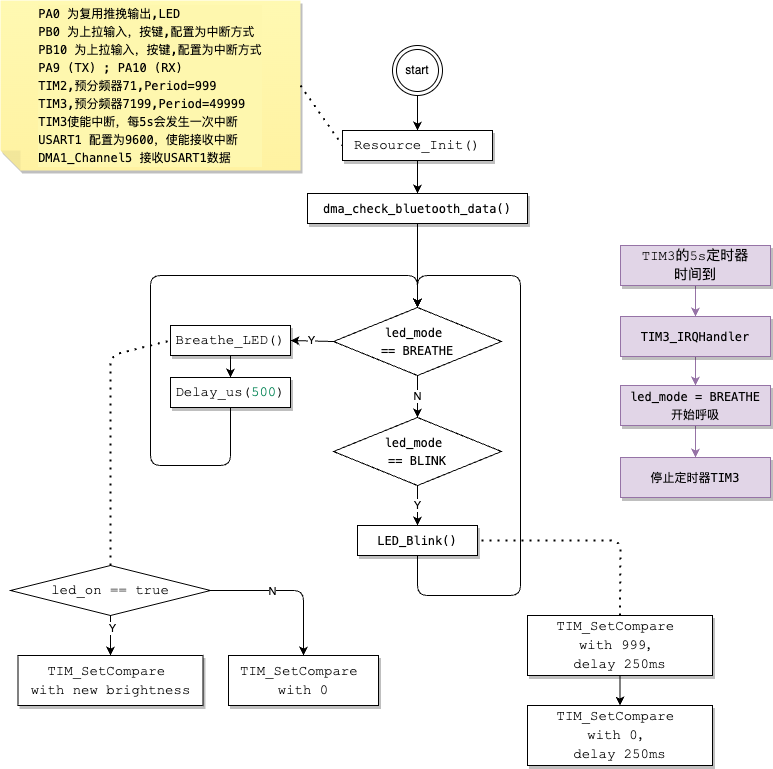

# DMA

• ⽬标：利⽤ DMA 取代中断函数实现 蓝⽛ 数据的读取（完成单字节的数据转运即可）  

• 问题：
  ◦ 介绍⼀下 DMA 的⼯作流程以及⼯作原理  
  ◦ DMA 是如何与 蓝⽛模块 配合使⽤的的？  

---

本工程在`蓝⽛通信` `6-Bluetoon-receive-data`的基础上修改。

## 关键实现
之前,蓝牙模块接收数据后会发送到USART1的Rx,然后触发Rx中断,这路我们移除,修改为DMA接收数据.
```c
/*DMA START------------------------------------------------------------------------------------------------*/
RCC_AHBPeriphClockCmd(RCC_AHBPeriph_DMA1, ENABLE);

// 配置 DMA1 通道5（用于 USART1 RX）
UTIL_DMA_CFG(DMA1_Channel5,               //
              (uint32_t)&USART1->DR,       /*外设地址（USART1 数据寄存器）*/
              (uint32_t)rxBuffer,          /*内存地址（缓冲区）*/
              DMA_DIR_PeripheralSRC,       /*数据方向：外设 -> 内存*/
              1,                           /*缓冲区大小 1*/
              DMA_PeripheralInc_Disable,   /*外设地址不递增*/
              DMA_MemoryInc_Disable,       /*内存地址不递增*/
              DMA_PeripheralDataSize_Byte, /*外设数据大小：字节*/
              DMA_MemoryDataSize_Byte,     /*内存数据大小：字节*/
              DMA_Mode_Circular,           /*循环模式*/
              DMA_Priority_High,           /*优先级高*/
              DMA_M2M_Disable);            /*禁止内存到内存传输*/

DMA_Cmd(DMA1_Channel5, ENABLE);                  /*启用 DMA1 通道5*/
USART_DMACmd(USART1, USART_DMAReq_Rx, ENABLE);   /*启用 USART1 的 DMA 接收功能*/
DMA_ITConfig(DMA1_Channel5, DMA_IT_TC, ENABLE);  /*使能 DMA1 通道5 的传输完成中断*/
UTIL_NVIC_CFG(DMA1_Channel5_IRQn, 0, 0, ENABLE); /*配置 NVIC 以响应 DMA 中断*/
/*DMA END-------------------------------------------------------------------------------------------------*/

/*DMA1 通道5 中断处理函数*/
void DMA1_Channel5_IRQHandler(void)
{
    /*检查 DMA 的传输完成中断标志*/
    if (DMA_GetITStatus(DMA1_IT_TC5))
    {
        uint8_t receivedByte = rxBuffer[0]; /*读取接收到的单字节数据*/
        if (receivedByte == (uint8_t)'s')
        {
            led_mode = BLINK;

            TIM_Cmd(TIM3, DISABLE);  /*停止定时器以确保重置*/
            TIM_SetCounter(TIM2, 0); /*重置计数器为0*/
            TIM_Cmd(TIM3, ENABLE);   /*重新启动定时器，开始新的5秒计时*/
        }

        DMA_ClearITPendingBit(DMA1_IT_TC5); /*清除 DMA 的传输完成中断标志*/
    }
}
```

## 流程图


<BR><BR><BR>

---

## Q1:介绍⼀下 DMA 的⼯作流程以及⼯作原理  
### DMA（Direct Memory Access，直接内存访问）的工作流程和原理

DMA（直接内存访问）是一种用于在外设和内存之间进行数据传输的机制，能够在不占用 CPU 资源的情况下，实现数据的高速搬运。DMA 控制器能够在外设（如 USART、SPI、ADC）与内存之间，或者在内存和内存之间进行数据传输，而无需 CPU 参与每次数据的传输过程，从而大大减轻了 CPU 的负担。

### DMA 的工作原理

DMA 控制器在微控制器系统中作为独立模块，它可以在没有 CPU 干预的情况下控制数据的搬运。CPU 只需启动 DMA 传输并配置相关参数，剩下的传输过程由 DMA 控制器全权处理。DMA 控制器可以直接访问微控制器的内存和外设地址总线，并根据配置在它们之间传输数据。

### DMA 的工作流程

1. **初始化和配置**：CPU 负责初始化 DMA 控制器，包括设置源地址、目标地址、传输的数据大小、传输模式（如外设到内存或内存到外设），以及选择需要使用的 DMA 通道。
   
2. **传输启动**：当 DMA 控制器被配置并启动后，它会监听外设的请求（如 USART、ADC 等外设的请求信号）。一旦外设准备好发送或接收数据，外设会向 DMA 控制器发送一个请求信号，表示数据准备就绪。

3. **DMA 传输过程**：
   - **外设到内存**：当外设准备好数据时，DMA 控制器从外设的数据寄存器中读取数据，并将其传输到指定的内存地址。传输完成后，DMA 控制器会自动更新目标内存地址和剩余数据量。
   - **内存到外设**：如果数据是从内存传输到外设，DMA 控制器会从指定的内存地址读取数据并写入到外设的数据寄存器中。

4. **传输完成/中断**：当 DMA 传输达到设定的数据大小后，它会产生一个传输完成中断（可选），通知 CPU 传输已完成。此时，CPU 可以进行进一步处理（如处理接收到的数据或启动新的任务）。

5. **循环模式（可选）**：如果使用循环模式，DMA 会在传输完成后自动重新开始传输，无需重新配置。循环模式通常用于需要持续数据传输的场景，如 ADC 采样或 UART 串口通信。

### DMA 的工作模式

1. **单次传输模式**：
   - DMA 控制器将数据从源地址传输到目标地址，传输完成后停止。适用于一次性的数据传输任务。
   
2. **循环传输模式**：
   - 在传输完成后，DMA 控制器会自动回到起始地址并重新开始传输。这种模式适用于连续的实时数据传输，如 ADC 的连续采样或 USART 的数据接收。

3. **外设到内存（Peripheral-to-Memory）**：
   - 这是最常见的 DMA 使用场景之一，例如 USART 接收数据时，可以将接收到的数据通过 DMA 传输到内存。DMA 将自动从外设数据寄存器读取数据，并将其搬运到指定的内存区域。

4. **内存到外设（Memory-to-Peripheral）**：
   - 此模式用于从内存读取数据并发送给外设。比如，通过 USART 发送一段数据时，DMA 可以自动从内存读取数据并传输到 USART 外设的发送寄存器。

5. **内存到内存（Memory-to-Memory）**：
   - DMA 还可以用于内存之间的数据传输。DMA 会从一个内存位置读取数据，并将其写入另一个内存位置。此模式常用于数据复制或缓冲区的管理。

### DMA 的关键参数

1. **源地址和目标地址**：
   - DMA 控制器需要知道数据的源地址（如外设的数据寄存器或内存地址）和目标地址（如内存或外设），以便进行正确的数据传输。

2. **传输方向**：
   - 配置 DMA 传输的方向，决定数据是从外设到内存、内存到外设，还是内存到内存。

3. **数据大小和传输长度**：
   - 需要配置 DMA 每次传输的数据大小（如 8 位、16 位或 32 位）以及总的数据传输长度。

4. **传输模式**：
   - 配置 DMA 是以单次传输方式运行，还是以循环模式运行。

5. **中断配置**：
   - 在传输完成或传输错误时，可以配置 DMA 产生中断，通知 CPU 传输的状态。

### DMA 的优势

1. **降低 CPU 负载**：
   - DMA 减少了 CPU 处理数据搬运的工作，允许 CPU 集中精力处理更高优先级的任务，而将数据传输任务交由 DMA 完成。

2. **提高传输效率**：
   - DMA 控制器以比 CPU 更高效的方式处理大批量数据传输，可以大幅提高系统的性能，特别是在高速数据传输场景中。

3. **支持并行处理**：
   - 在 DMA 传输数据的同时，CPU 可以同时处理其他任务，从而提高了系统的并行处理能力。

4. **实时性和低延迟**：
   - DMA 适用于实时系统，能够快速响应外设的数据传输需求，避免 CPU 处理数据时产生的延迟。

---

## Q2:DMA 是如何与 蓝⽛模块 配合使⽤的的？

蓝牙 => stm32 USART1 Rx => DMA Channl5 => 触发DMA中断。

