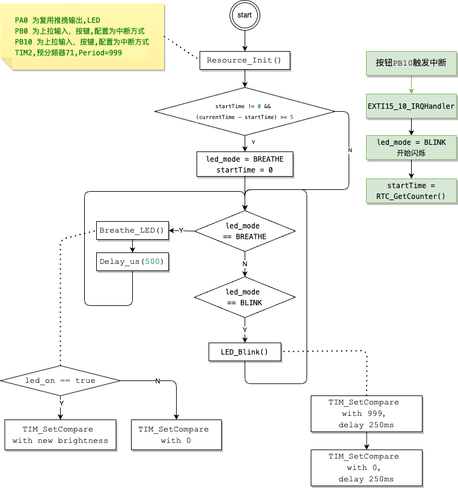

# RTC

• ⽬标：利⽤ RTC 模块在 四(4-breathing-Blink-auto-switch) 中实现模式的⾃动切换 

---

## 关键步骤，初始化RTC
### **STM32 RTC 初始化与使用**

STM32 系列中的 **RTC（Real-Time Clock）** 是一项低功耗外设，用于提供精确的时间和日期信息，即使系统掉电后，RTC 也可以通过备份电池维持时间运行。

以下是 **RTC 的初始化步骤**及如何在 STM32F103C8T6 等 MCU 上使用 RTC。

---

## **1. RTC 初始化步骤**

1. **使能 PWR（电源控制）和 BKP（备份寄存器）时钟**。
2. **取消备份区域写保护**。
3. **使能 RTC 时钟源**，通常选择 **LSE（低速外部晶振 32.768kHz）** 或 **LSI（低速内部 RC 振荡器）**。
4. **配置 RTC 预分频器**，以设置 RTC 的时钟频率（通常为 1Hz）。
5. **设置时间和日期**。

## 流程图


<BR><BR><BR>

```c
/*RTC配置 START---------------------------------------------------------------------------------------------*/
RCC_APB1PeriphClockCmd(RCC_APB1Periph_PWR, ENABLE); /** 启用 PWR 时钟 **/
RCC_APB1PeriphClockCmd(RCC_APB1Periph_BKP, ENABLE); /** 启用 BKP 时钟 **/

PWR_BackupAccessCmd(ENABLE); /** 允许访问备份寄存器 **/
if (BKP_ReadBackupRegister(BKP_DR1) != 0xA5A5)
{
    RCC_LSICmd(ENABLE);
    while (RCC_GetFlagStatus(RCC_FLAG_LSIRDY) != SET)
        ;

    RCC_RTCCLKConfig(RCC_RTCCLKSource_LSI);
    RCC_RTCCLKCmd(ENABLE);

    RTC_WaitForSynchro();
    RTC_WaitForLastTask();

    RTC_SetPrescaler(40000 - 1);
    RTC_WaitForLastTask();

    BKP_WriteBackupRegister(BKP_DR1, 0xA5A5);
}
else
{
    RCC_LSICmd(ENABLE);
    while (RCC_GetFlagStatus(RCC_FLAG_LSIRDY) != SET)
        ;

    RCC_RTCCLKConfig(RCC_RTCCLKSource_LSI);
    RCC_RTCCLKCmd(ENABLE);

    RTC_WaitForSynchro();
    RTC_WaitForLastTask();
}
/*RTC配置 END-----------------------------------------------------------------------------------------------*/
```

在main函数中根据时间的差值来做到自动切换
```c
int main(void)
{
    SystemInit();    /** 配置系统时钟 **/
    Resource_Init(); /** 配置系统用到的所有资源 **/
    OLED_Init();     /*OLED初始化*/

    uint32_t startTime = RTC_GetCounter(); /** 记录开始时间 **/

    while (1)
    {
        uint32_t currentTime = RTC_GetCounter(); /** 获取当前时间 **/

        if ((currentTime - startTime) >= 5) /*如果时间差超过 5 秒*/
        {
            if (led_mode == BREATHE)
                led_mode = BLINK;
            else
                led_mode = BREATHE;

            startTime = currentTime; /** 重置开始时间，等待下一次 5 秒 **/
        }

        if (led_mode == BREATHE)
        {
            Breathe_LED(); /*控制 LED 呼吸灯*/
            Delay_us(500); /**
                            * 目标是：1s 完成呼吸一次，暗变亮->亮变暗,
                            * 调整呼吸速度, main函数中 0.5ms(毫秒) 调度一次 Breathe_LED()
                            * 1s 调度2000次，占空比的变化是: 0->999 然后 999->0
                            */
        }
        else if (led_mode == BLINK)
        {
            LED_Blink();
        }
    }
}
```

