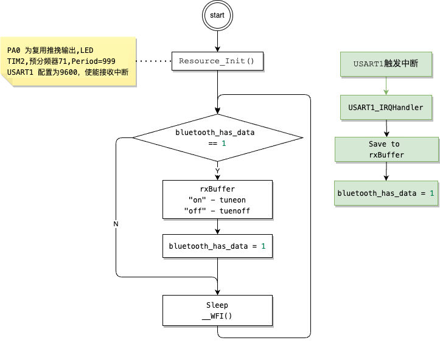

# PWR

• ⽬标：加⼊ PWR 模块，在等待 蓝⽛ 接收数据时进⼊睡眠模式  
• 提⽰：⾃定义数据包格式以实现多字节数据的接收与处理

• 问题：
◦   除了睡眠模式还有什么低功耗模式？简要介绍⼀下  


---
## 硬件连接
连接 HC-05 到 STM32 的 USART1 引脚,参考引脚定义文档得知，USART1 TX RX 对应的是PA9 PA10 .
```
PA9 	I/O 	FT 	PA9 	USART1_TX/TIM1_CH2
PA10 	I/O 	FT 	PA10 	USART1_RX/TIM1_CH3
```
**HC-05 TXD ↔ STM32 PA10 (USART1 RX 引脚)**
-   HC-05 的 TXD 引脚连接到 STM32 的 PA10（USART1 的 RX 引脚），用于接收来自 HC-05 的数据。

**HC-05 RXD ↔ STM32 PA9 (USART1 TX 引脚)**
-   HC-05 的 RXD 引脚连接到 STM32 的 PA9（USART1 的 TX 引脚），用于发送数据到 HC-05。

**HC-05 VCC ↔ STM32 3.3V 或 5V 电源**
-   连接到 STM32 的 3.3V 或 5V 电源。

**HC-05 GND ↔ STM32 GND**
-   连接到 STM32 的 GND 引脚。


## ⾃定义数据包格式以实现多字节数据的接收与处理
数据包的格式是`cmd\n`,就是命令后面跟一个换行符`\n`, e.g. `on\n` `off\n`

## 配置USART（串口）
```c
/*UART START-----------------------------------------------------------------------------------------------*/
UTIL_USART_CFG(9600, USART_WordLength_8b, USART_StopBits_1, USART_Parity_No, //
                USART_HardwareFlowControl_None, USART_Mode_Rx | USART_Mode_Tx);
USART_Cmd(USART1, ENABLE);
USART_ITConfig(USART1, USART_IT_RXNE, ENABLE); /*使能 USART1 接收中断*/

UTIL_NVIC_CFG(USART1_IRQn, 1, 1, ENABLE); /*配置 NVIC，处理 UART 中断*/
/*UART END-------------------------------------------------------------------------------------------------*/
```

## 串口中断处理
```c
/*串口中断处理*/
void USART1_IRQHandler(void)
{
    // 检查是否是接收中断
    if (USART_GetITStatus(USART1, USART_IT_RXNE) != RESET)
    {
        char receivedChar = USART_ReceiveData(USART1); /*读取接收到的数据 */
        rxBuffer[bufferIndex++] = receivedChar;        /*将接收到的数据存入缓冲区*/

        if (receivedChar == '\n') /*如果接收到换行符，认为数据包结束*/
        {
            rxBuffer[bufferIndex - 1] = '\0'; /* 把\n替换成\0结束符 */
            bufferIndex = 0;                  /* 重置缓冲区索引 */
            bluetooth_has_data = 1;
        }
    }
}
```

## 流程图


<BR><BR><BR>

---

## Q1:除了睡眠模式还有什么低功耗模式？简要介绍⼀下
STM32 微控制器除了**睡眠模式（Sleep Mode）**外，还支持其他几种低功耗模式，主要有**停止模式（Stop Mode）**和**待机模式（Standby Mode）**。以下是各模式的简要介绍：

### 1. 睡眠模式（Sleep Mode）

- **特点**：只停止 CPU，所有外设和时钟源继续运行。
- **功耗**：相对较低，但仍然支持外设的正常工作。
- **唤醒**：可以通过任何可用的外设中断来唤醒。
- **应用场景**：适合需要 CPU 暂时不工作，但需要外设继续运行的情况，例如等待数据接收。

### 2. 停止模式（Stop Mode）

- **特点**：主时钟（HCLK）和所有 PLL 时钟都会关闭，系统进入深度睡眠模式，但保留 SRAM 和寄存器的内容。
- **功耗**：比睡眠模式更低，仅保持系统内存和寄存器的数据。
- **唤醒**：通过外部中断、实时时钟（RTC）或低功耗定时器（LPTIM）等唤醒。
- **应用场景**：适合在长时间内无需外设运行，但需要保留数据的情况，例如需要等待低频事件时。

### 3. 待机模式（Standby Mode）

- **特点**：几乎所有时钟和电源都关闭，仅保持少数备份寄存器（BKP）和 RTC。
- **功耗**：最小的功耗状态，是 STM32 系列的最低功耗模式。
- **唤醒**：只能通过外部复位、RTC 闹钟、或唤醒引脚（WKUP）唤醒，唤醒后系统会重新启动。
- **应用场景**：适合长时间不工作，并且不需要保留数据的极低功耗应用，例如深度睡眠的传感器节点。

### 4. 关闭未使用的外设时钟

在 STM32 中除了低功耗模式，还可以通过关闭未使用的外设时钟来降低功耗。例如在应用中仅保留必要的时钟源（如 RTC 或某些定时器的时钟），通过 `RCC_APB1PeriphClockCmd()` 和 `RCC_APB2PeriphClockCmd()` 等函数可以有效减少系统功耗。

### 总结

- **睡眠模式**：仅停止 CPU，外设继续工作。
- **停止模式**：停止主时钟，保留内存数据，唤醒后恢复。
- **待机模式**：最低功耗模式，关闭几乎所有电源和时钟，只能通过少数方式唤醒，唤醒后系统重新启动。