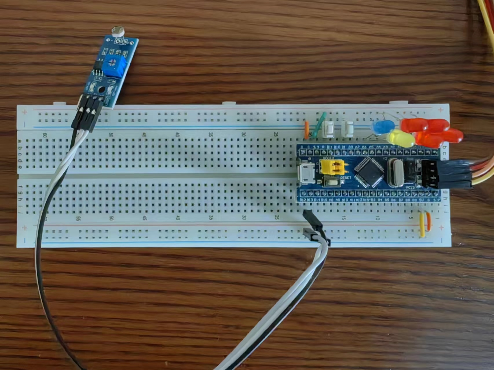

## 电路图

## 第一个工程: 模板工程，点亮LED 灯
**参见 3-1-stm32工程模板**

## 用按键实现 LED 的可控闪烁
**参见 3-2-按键控制**

## 使用delay函数完成led以特定频率闪烁
**参见 3-3-频率闪烁**

---

## 用GPIO实现流水灯效果
**参见 3-4-流水灯**

## 使用光传感器实现“天亮灯灭，天暗灯亮
**参见 3-5-光传感器**
