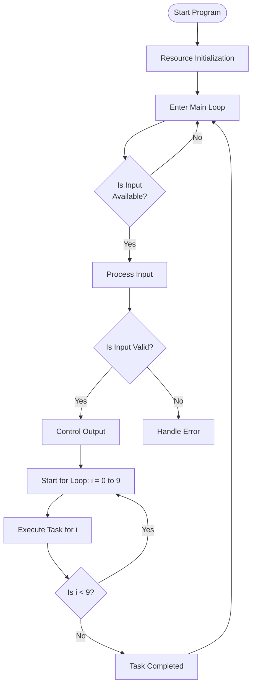
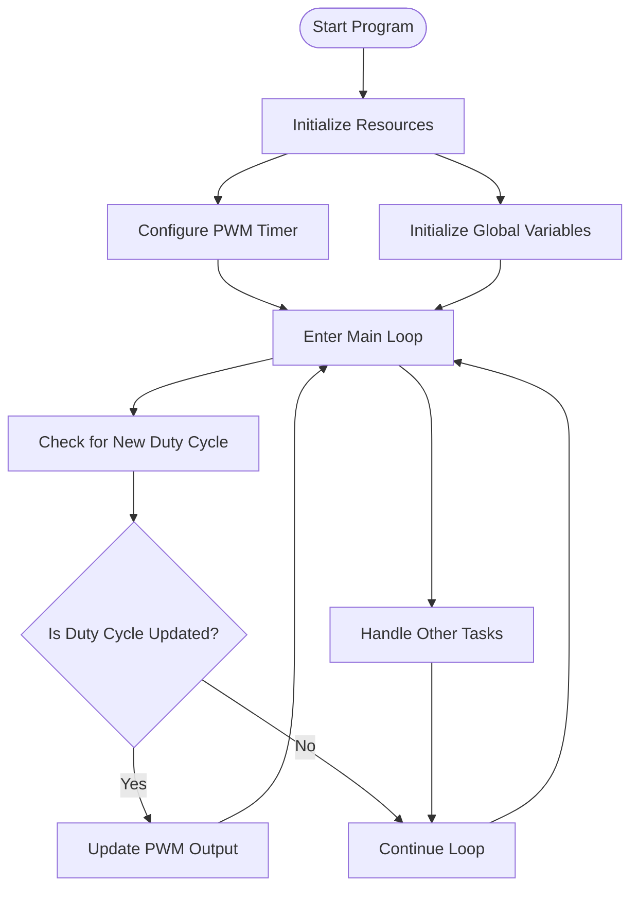
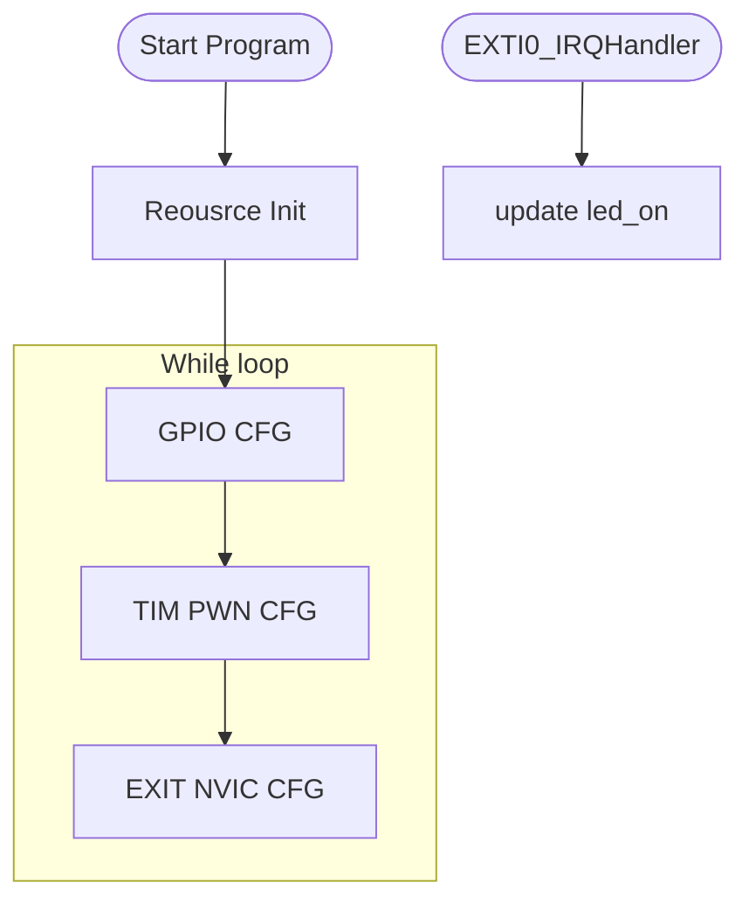
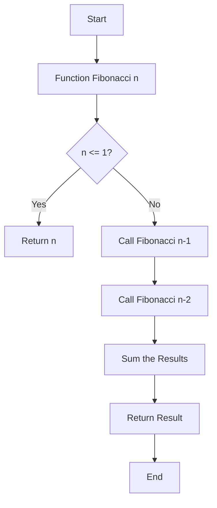

```mermaid
flowchart TD
    A([Start Program]) --> B[Resource Initialization]
    B --> C[Enter Main Loop]

    %% while(1) 循环
    C --> D{Is Input <BR>        Available?}
    D -- Yes --> E[Process Input]
    D -- No --> C  

    %% if-else 分支逻辑
    E --> F{Is Input Valid?}
    F -- Yes --> G[Control Output]
    F -- No --> H[Handle Error]

    %% for 循环逻辑
    G --> I[Start for Loop: i = 0 to 9]
    I --> J[Execute Task for i]
    J --> K{Is i < 9?}
    K -- Yes --> I  
    K -- No --> L[Task Completed]

    %% 返回主循环
    L --> C  

```

```mermaid
flowchart TD
    A([Start Program]) --> B[Initialize Resources]

    %% 创建并行分支
    B --> C1[Configure PWM Timer]
    B --> C2[Initialize Global Variables]

    %% 合并并行路径
    C1 --> D[Enter Main Loop]
    C2 --> D

    %% 主循环中的并行逻辑
    D --> E1[Check for New Duty Cycle]
    D --> E2[Handle Other Tasks]

    E1 --> F1{Is Duty Cycle Updated?}
    F1 -- Yes --> G1[Update PWM Output]
    F1 -- No --> H1[Continue Loop]

    E2 --> H1

    %% 回到主循环
    G1 --> D
    H1 --> D

```

```mermaid
flowchart TB
    A([Start Program]) --> B[Reousrce Init]
    B-->C11[Main Loop]

    
    subgraph While_loop[ While loop]
        direction LR
        C11[GPIO CFG]
        C12[TIM PWN CFG]
        C13[EXIT NVIC CFG]
        C11 --> C12 --> C13
    end

    

    
    
    K([EXTI0_IRQHandler])
    K-->L[update led_on]

    %% C13---K
    

    

```

```mermaid
flowchart TD
    A[Start] --> B[Function Fibonacci n]
    B --> C{n <= 1?}
    C -- Yes --> D[Return n]
    C -- No --> E[Call Fibonacci n-1]
    E --> F[Call Fibonacci n-2 ]
    F --> G[Sum the Results]
    G --> H[Return Result]
    H --> I[End]


```