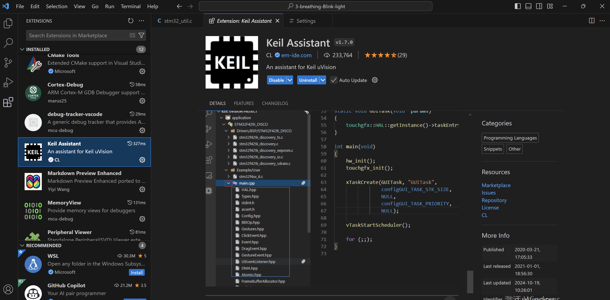
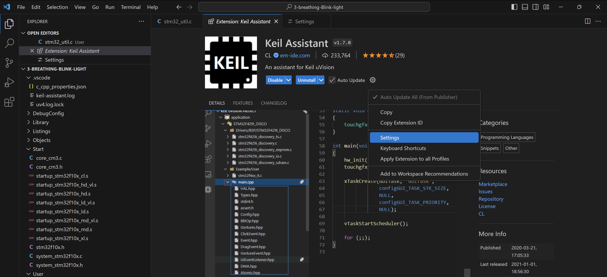
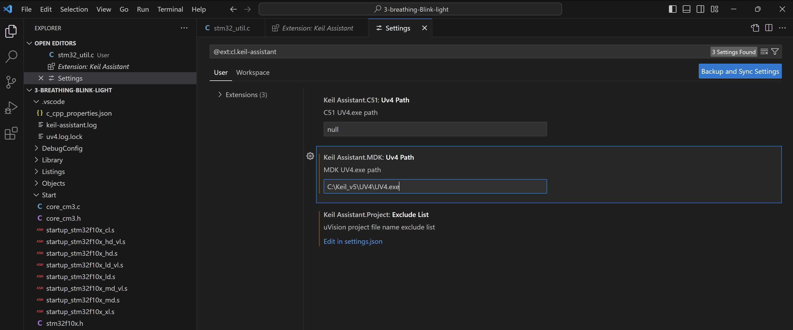
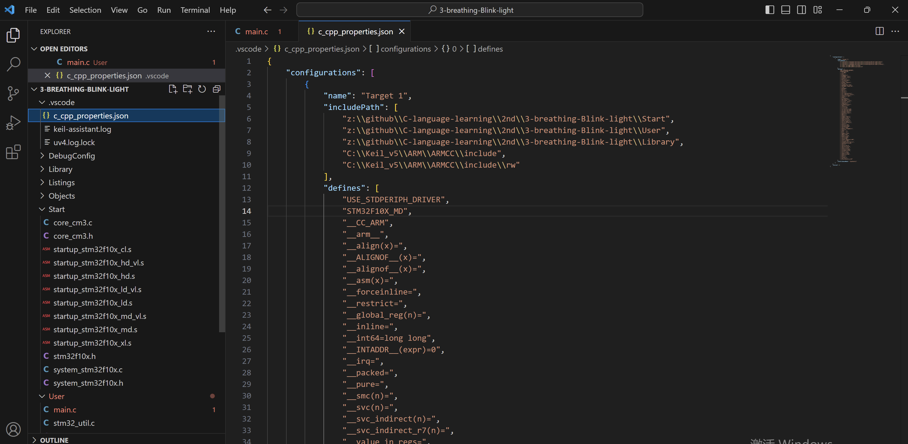

# VS Code 编辑keil 工程

### **Keil Assistant 插件简介**

`Keil Assistant` 是一个 VS Code 插件，旨在帮助开发者更方便地管理 Keil µVision 项目，使得你可以在 **VS Code 中编写、查看代码**，而无需频繁切换到 Keil IDE。它适合那些习惯使用 VS Code 编写代码的开发者。

---

## 安装 Keil Assistant

1. 打开 **VS Code**。
2. 进入左侧的扩展商店，搜索 **Keil Assistant**。
3. 点击 **安装**。

安装完成后，Keil Assistant 就集成到 VS Code 中了。

## 配置Keil Assistant

点击小齿轮

这里主要就是配置keil的安装路径，我的是 `C:\Keil_v5\UVv4\UV4.exe`, 你的需要确定正确的路径。

到这里就配置好了，如果当前VSCode 中已经打开了keil的工程，就直接重启VS Code.
再次打开VS Code, `Keil Assistant`这个插件会自动检测当前目录下有没有 *.uvprojx 这个文件(\* 代表通配)，比如`Project.uvprojx`, 如果有的话就认为当前工程是一个Keil的工程，然后就会自动生成一个.vscode的文件夹，下面有一个重要的文件`c_cpp_properties.json`

c_cpp_properties.json 是 VS Code 中用于配置 C/C++ 开发环境的文件，主要为 C/C++ 插件提供头文件路径、编译器配置和 IntelliSense 支持。对于 STM32 或其他嵌入式开发项目，配置正确的 c_cpp_properties.json 文件可以使代码智能提示、语法检查、跳转等功能正常工作。

